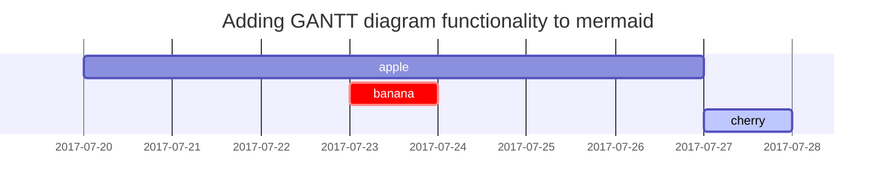

This post is to show Markdown syntax rendering on [**Chirpy**](https://github.com/cotes2020/jekyll-theme-chirpy/fork), you can also use it as an example of writing. Now, let's start looking at text and typography.

이 포스트는 해당 지킬 테마의 원작자가 작성한 방법을 토대로 정리하고 일부 추가하였습니다. <br>
original author : cotes <br>
edited by luejenie

<h2 data-toc-skip> 마크다운(Markdown) 사용법</h2>
---

## Titles (제목)
---
1. < h태그 >
2. \# 사용

<h1 data-toc-skip> H1 - heading </h1>

<h2 data-toc-skip>H2 - heading</h2>

<h3 data-toc-skip>H3 - heading</h3>

<h4>H4 - heading</h4>

<h5>H5 - heading</h5>

<h6>H6 - heading</h6>


<h1 data-toc-skip> # 제목</h1>
<h2 data-toc-skip> ## 제목</h2>
<h3 data-toc-skip> ### 제목</h3>
#### #### 제목
##### ##### 제목
###### ###### 제목(6단계까지 가능)
<br>

## Contents (목차)
오른쪽 목차 사용하려면,
1. \## : 대분류
2. \### : 소분류

---

## Paragraph (문단)
1. 줄바꿈을 두 번하기
2. 역슬래시(\\) 넣기

Quisque egestas convallis ipsum, ut sollicitudin risus tincidunt a. Maecenas interdum malesuada egestas. Duis consectetur porta risus, sit amet vulputate urna facilisis ac. Phasellus semper dui non purus ultrices sodales. Aliquam ante lorem, ornare a feugiat ac, finibus nec mauris. Vivamus ut tristique nisi. Sed vel leo vulputate, efficitur risus non, posuere mi. Nullam tincidunt bibendum rutrum. Proin commodo ornare sapien. Vivamus interdum diam sed sapien blandit, sit amet aliquam risus mattis. Nullam arcu turpis, mollis quis laoreet at, placerat id nibh. Suspendisse venenatis eros eros.


Lorem Ipsum is simply dummy text of the printing and typesetting industry. Lorem Ipsum has been the industry's standard dummy text ever since the 1500s, when an unknown printer took a galley of type and scrambled it to make a type specimen book. It has survived not only five centuries, but also the leap into electronic typesetting, remaining essentially unchanged. It was popularised in the 1960s with the release of Letraset sheets containing Lorem Ipsum passages, and more recently with desktop publishing software like Aldus PageMaker including versions of Lorem Ipsum.

---

### 가로선
1. \* * * 
2. \*** 
3. \* 5개 *****
4. \- 3개 --- 


---
## Lists

### Ordered list (순서 있는 목록)

1. Firstly
2. Secondly
3. Thirdly

### Unordered list (순서 없는 목록)
1. -, +, * 중 하나 사용
2. 스페이스바 2번, 스페이스바 4번 (들여쓰기되면서 글머리표 변경됨)

* Chapter
* Section
* Paragraph


+ Chapter
  + 스페이스바 2번
    + 스페이스바 4번

---
### 한 줄 아래로
1. \<br>
2. 내용 끝에 역슬래쉬(\\) 


### 굵게, 기울이기
1. 굵게 : \**글자** **글자**
2. 기울이기 : \_글자_  _글자_


### 문법 그대로 보이기
- 맨 앞에 역슬래시(\\) 사용하기


---
### ToDo list
- \[ ] : 빈 체크
- \[x] : 체크

- [ ] Job
  + [x] Step 1
  + [x] Step 2
  + [ ] Step 3

### Description list
- 단어 쓰고 아래에 : 하고 설명 쓰기
- 깃허브 블로그
- : 설명 예시

깃허브 블로그
: 설명 예시


Sun
: the star around which the earth orbits

Moon
: the natural satellite of the earth, visible by reflected light from the sun

## Block Quote (인용문)
1. \> 사용 
2. \>> 사용

- \> 인용문 예시
> 인용문 예시

- \>> 두 개 사용한 인용문 예시
>> 인용문 예시


> This line shows the _block quote_.

## Prompts

> An example showing the `tip` type prompt.
{: .prompt-tip }

> An example showing the `info` type prompt.
{: .prompt-info }

> An example showing the `warning` type prompt.
{: .prompt-warning }

> An example showing the `danger` type prompt.
{: .prompt-danger }

## Tables (표)
- \| : 행 구분
- :--------------- : 열 구분

| Company                      | Contact          | Country |
|:-----------------------------|:-----------------|--------:|
| Alfreds Futterkiste          | Maria Anders     | Germany |
| Island Trading               | Helen Bennett    | UK      |
| Magazzini Alimentari Riuniti | Giovanni Rovelli | Italy   |

## Links (링크)
1. <> 사이에 링크 넣기 \<http://127.0.0.1:4000>
2. \[링크명](링크주소) \[home](http://127.0.0.1:4000)

## Footnote (주석)
- 주석하고자 하는 내용 옆에 \[^주석]

Click the hook will locate the footnote[^footnote], and here is another footnote[^fn-nth-2].

## Inline code
- `` 사이에 쓰기
- \`inline Code`

This is an example of `Inline Code`.

## Filepath
- \`/path/to/the/file.extend`{: .filepath}

Here is the `/path/to/the/file.extend`{: .filepath}.

## Code blocks

### Common
- ```
- 사이에 내용
- ```

```
This is a common code snippet, without syntax highlight and line number.
```

### Specific Language

```bash
if [ $? -ne 0 ]; then
  echo "The command was not successful.";
  #do the needful / exit
fi;
```

### Specific filename

```sass
@import
  "colors/light-typography",
  "colors/dark-typography"
```
{: file='_sass/jekyll-theme-chirpy.scss'}

## Mathematics

The mathematics powered by [**MathJax**](https://www.mathjax.org/):

$$ \sum_{n=1}^\infty 1/n^2 = \frac{\pi^2}{6} $$

When $a \ne 0$, there are two solutions to $ax^2 + bx + c = 0$ and they are

$$ x = {-b \pm \sqrt{b^2-4ac} \over 2a} $$

## Mermaid SVG



## Images

### Default (with caption)

{: width="972" height="589" }
_Full screen width and center alignment_

### Left aligned

{: width="972" height="589" .w-75 .normal}

### Float to left

{: width="972" height="589" .w-50 .left}
Praesent maximus aliquam sapien. Sed vel neque in dolor pulvinar auctor. Maecenas pharetra, sem sit amet interdum posuere, tellus lacus eleifend magna, ac lobortis felis ipsum id sapien. Proin ornare rutrum metus, ac convallis diam volutpat sit amet. Phasellus volutpat, elit sit amet tincidunt mollis, felis mi scelerisque mauris, ut facilisis leo magna accumsan sapien. In rutrum vehicula nisl eget tempor. Nullam maximus ullamcorper libero non maximus. Integer ultricies velit id convallis varius. Praesent eu nisl eu urna finibus ultrices id nec ex. Mauris ac mattis quam. Fusce aliquam est nec sapien bibendum, vitae malesuada ligula condimentum.

### Float to right

{: width="972" height="589" .w-50 .right}
Praesent maximus aliquam sapien. Sed vel neque in dolor pulvinar auctor. Maecenas pharetra, sem sit amet interdum posuere, tellus lacus eleifend magna, ac lobortis felis ipsum id sapien. Proin ornare rutrum metus, ac convallis diam volutpat sit amet. Phasellus volutpat, elit sit amet tincidunt mollis, felis mi scelerisque mauris, ut facilisis leo magna accumsan sapien. In rutrum vehicula nisl eget tempor. Nullam maximus ullamcorper libero non maximus. Integer ultricies velit id convallis varius. Praesent eu nisl eu urna finibus ultrices id nec ex. Mauris ac mattis quam. Fusce aliquam est nec sapien bibendum, vitae malesuada ligula condimentum.

### Dark/Light mode & Shadow

The image below will toggle dark/light mode based on theme preference, notice it has shadows.

{: .light .w-75 .shadow .rounded-10 w='1212' h='668' }
{: .dark .w-75 .shadow .rounded-10 w='1212' h='668' }

## Video



## Reverse Footnote

[^footnote]: The footnote source
[^fn-nth-2]: The 2nd footnote source
